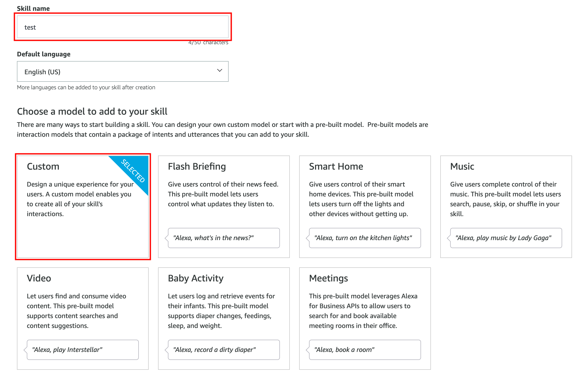
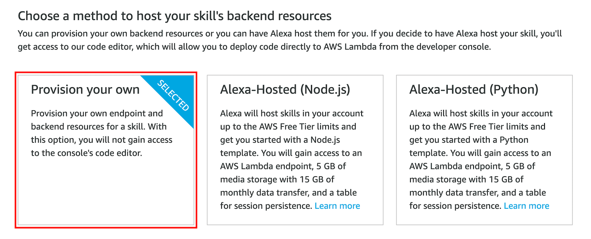

# ODA-Alexa Integration - Alexa Set Up

This part of the lab builds the Alexa side of the integration.

## Objectives

- Creating a Skill
- Configuring the Skill

## Steps

### **STEP 1**: Your Amazon Developer Account

- If you do not have a developer account, sign up for one here: [Sign Up](https://developer.amazon.com/en-US/alexa/alexa-skills-kit/start)

### **STEP 2**: Log in to your account

- Sign in to the developer console using your Amazon Developer account. This may require a one-time PIN which will be sent to your email. 

### **STEP 3**: Creating a Skill

- Ensure Skills Tab is selected 

- Click **Create Skill**.

  

- Enter your skill name.

- Under **Choose a model to add**, select 'Custom'. Under **Choose a method to host your skill's backend resources**, select 'Provision your own'. 

  
  
  

- Click **Create Skill**.

- From **Choose a template**, select 'Start from scratch'.

  

### **STEP 4**: Define the Skill

- From the created skill, select the **Invocation** option on the left panel.

- Under **Skill Invocation Name**, enter the phrase you would like to invoke the bot (must be 2 words).

- Select the **Slot Types** option on the left panel. 

- Select **Add Slot Type**. Select **Create custom slot type** and enter a name for your slot. 

- Find the **Intent** option on the left panel.

- Create a new Intent with the **Add Intent** button

- Select **Create custom intent** and enter a name for your intent. This name cannot be the same as your slot name that you created previously. 

- In **Sample Utterances**, enter {command}

- Scroll down and find **Intent Slots**. For 'command' select your custom slot type as the slot type. 

### **STEP 5**: Note the Skill ID

- Scroll to the top of the page and press the 'Your Skills' option. 

- Find your skill in the list, and click 'View Skill ID'. Write down this ID, as we will be using it later. 

**This completes the Set Up!**

**You are ready to proceed to [Lab 200](ODA-Alexa-200.md)**

