# ODA-Alexa Integration - Heroku Node Server Setup

Updated: November 1st, 2019

This part of the lab builds the backend server to be hosted on Heroku. The backend server uses Node JS and effectively sits between Alexa and Digital Assistant, translating each other's output into input recognized by the other.

## Objectives
- Create Heroku account
- Set up Heroku on local computer
- Create a Heroku Application
- Configure webhooks
  - Update Digital Assistant channel URL
  - Update Amazon endpoint
- Configure and deploy Node JS server
  - Update Amazon AppID
  - Update Channel Secret Key and Channel URL
  - Modify `package.json`
- Test the application

## Required Artifacts
- Oracle Digital Assistant Skill
- Heroku Account
- **Download the Node JS code [here](https://app.compendium.com/api/post\_attachments/32ab85fd-0f44-4856-a79f-91a61359717b/view)** and unzip the zip file. The code has the following structure:

```
MyAlexaWebhook
  index.js
  invocation.json
  package.json
  README.md
  server.js
```

# Create Heroku Account

Follow this [link](https://signup.heroku.com/?c=70130000001xDpdAAE&gclid=Cj0KCQjwuZDtBRDvARIsAPXFx3DyRB323ksXfO_lYs7W14RB6CRCTQjMBNQTOuElUazr4rbuGysu78waAvLDEALw_wcB) to create a Heroku account. 

# Set up Heroku on local computer

Follow this [link](https://devcenter.heroku.com/articles/getting-started-with-nodejs#set-up) to set up Heroku on a local computer. For macOS, either the brew command or the download will install Heroku. To check on macOS, open a terminal (press command+space and search "terminal") and run `command -v heroku`. If you see something along the lines of `/usr/.../heroku` then heroku is installed.

# Heroku application deployment setup

## Follow the below steps to create an app in heroku and deploy the sample code.

### **STEP 1**: Go to Heroku dashboard and create an app

- Click **New** and then **Create new app**.

  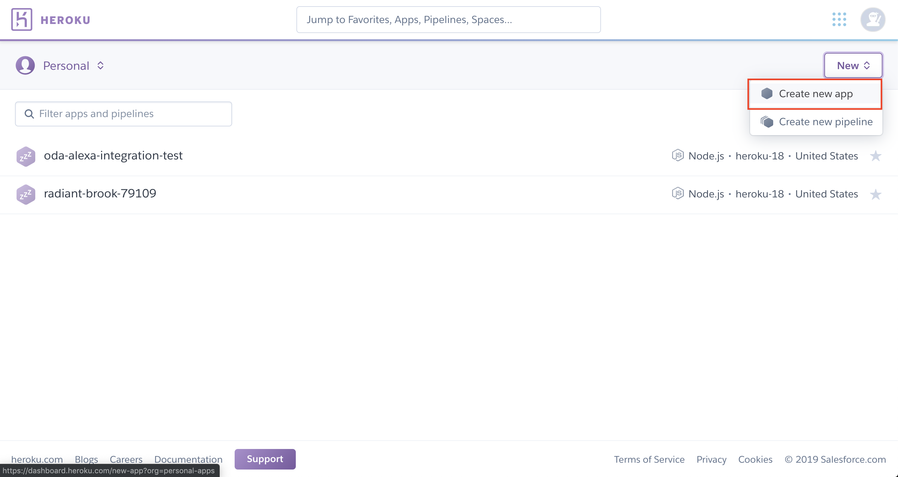  

- You may optionally enter a unique app name. If you choose not to, Heroku will generate one for you.
  **OR**
  Create an app from the [command line interface](https://devcenter.heroku.com/articles/creating-apps).

  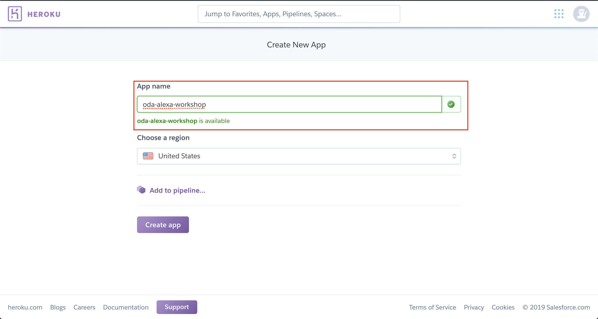

### **STEP 2**: Initialize server directory

- In your terminal (macOS/linux: terminal; windows: install git bash), go **INTO** the directory you downloaded. Make sure the downloaded zip file is unzipped. For instance, if the zip file was downloaded to your downloads folder and unzipped there, run

```
cd Downloads/MyAlexaWebhook
```

- Log into Heroku by running the following command:

```
heroku login
```

- Initialize a Heroku Github repository in `MyAlexaWebhook`. This is for tracking changes you make to the code and for pushing (uploading) your changes to your Heroku server.

```
git init
heroku git: remote -a <INSERT APP NAME>
```

  Remember to replace <INSERT APP NAME> with the Heroku app name from **STEP 1**.

# Configure webhooks

## In this section we will use the Heroku application name to finalize the webhook URLs.

### **STEP 1**: Go to your Oracle Digital Assistant Instance

  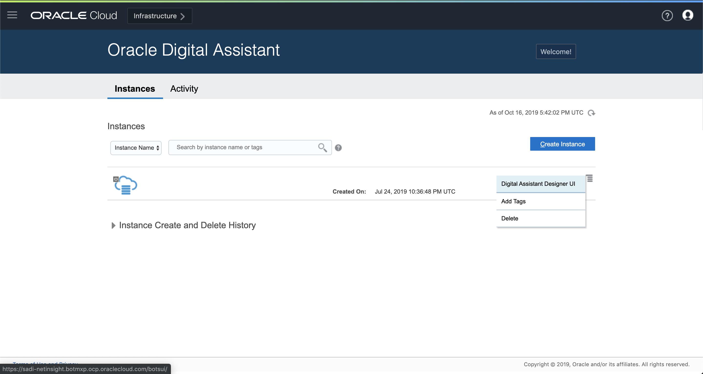

### **STEP 2**: Navigate to the channel you created in lab 050, step 5

- Change the **Outgoing Webhook URI** to `https://HEROKU_SERVER_NAME.herokuapp.com/singleBotWebhook/messages` where `HEROKU_SERVER_NAME` is the name of the Heroku application.

  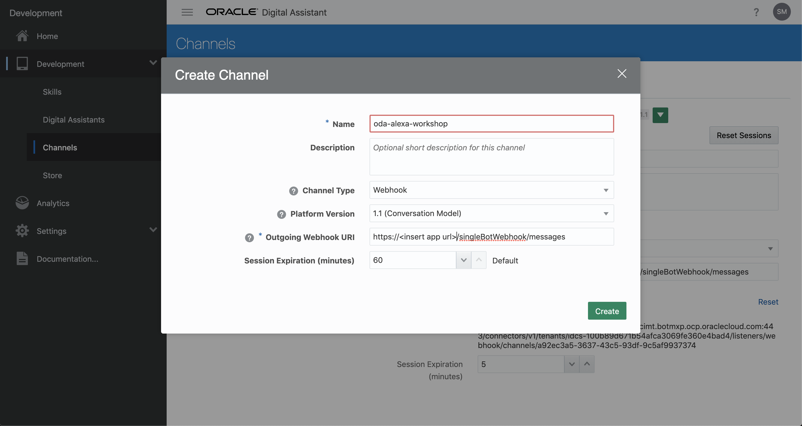

### **STEP 3**: Go to your Alexa Skill

- Click on your skill to open the development console.

  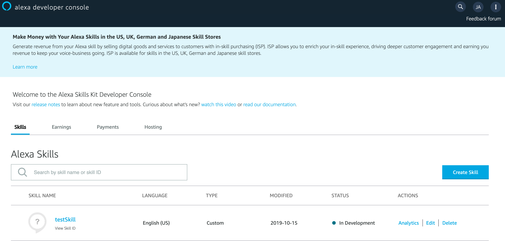

### **STEP 4**: Navigate to endpoints

- Click on "Endpoints" on the left-hand navigation menu.

  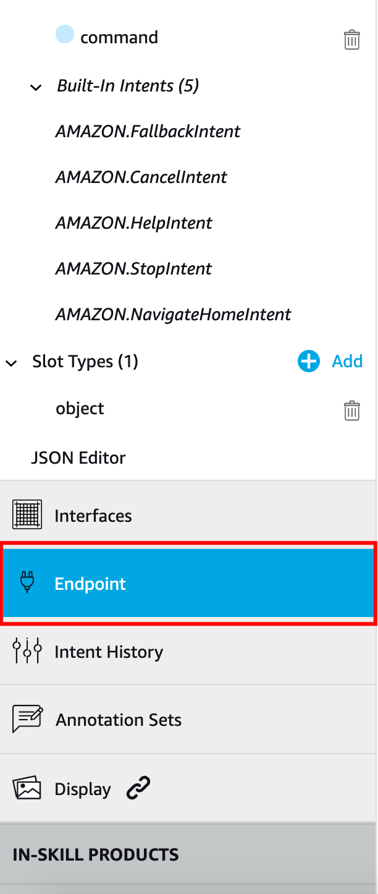

### **STEP 5**: Configure the endpoint

- Select HTTPS. Edit the **default region** module.

- The **URL** will be `https://HEROKU_SERVER_NAME.herokuapp.com/alexa/app`.

- Select "My deployment endpoint is a sub-domain of a domain that has a wildcard certificate from a certificate authority".

  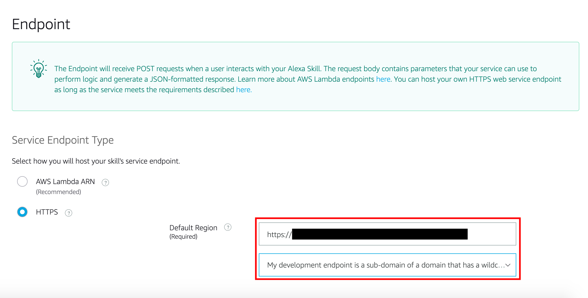
 
# Deploy Node JS application

## Before we redeploy the Node JS application we need to make some changes in `service.js`.

### **STEP 1**: Open `service.js` in a code editor

- You may use VSCode (shown), your favorite Integrated Development Environment (IDE), Notepad, ViM, etc.

  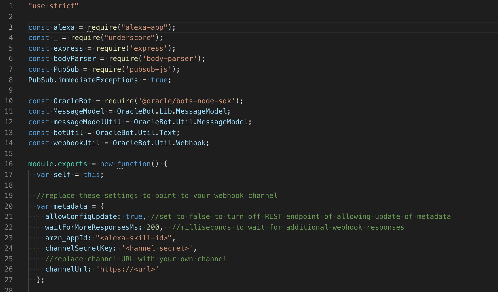

### **STEP 2**: Change amazon application ID in `service.js`

- Use the amazon application id (see lab 100 step 5) and copy it here:

  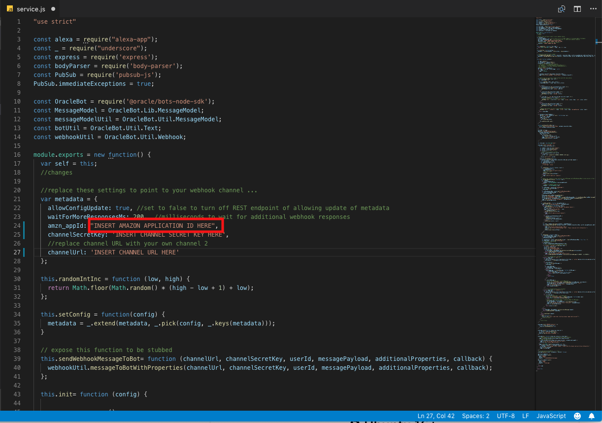

### **STEP 3**: Change channelSecretKey in `service.js`

  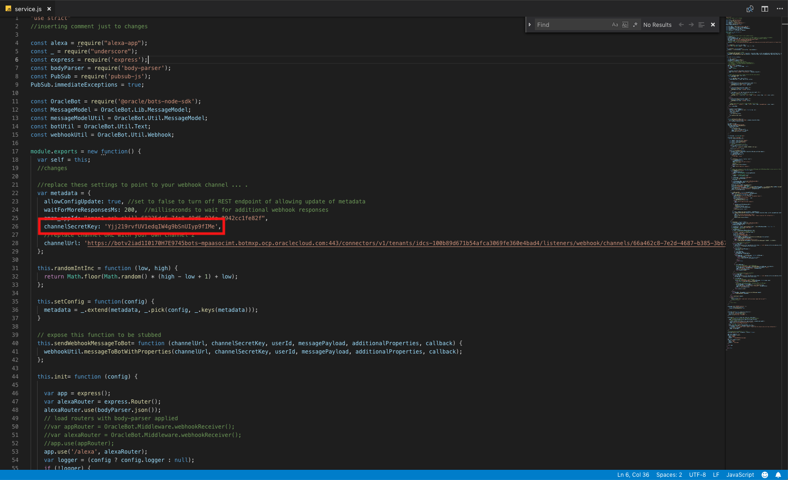

### **STEP 4**: Change channelUrl in `service.js`

  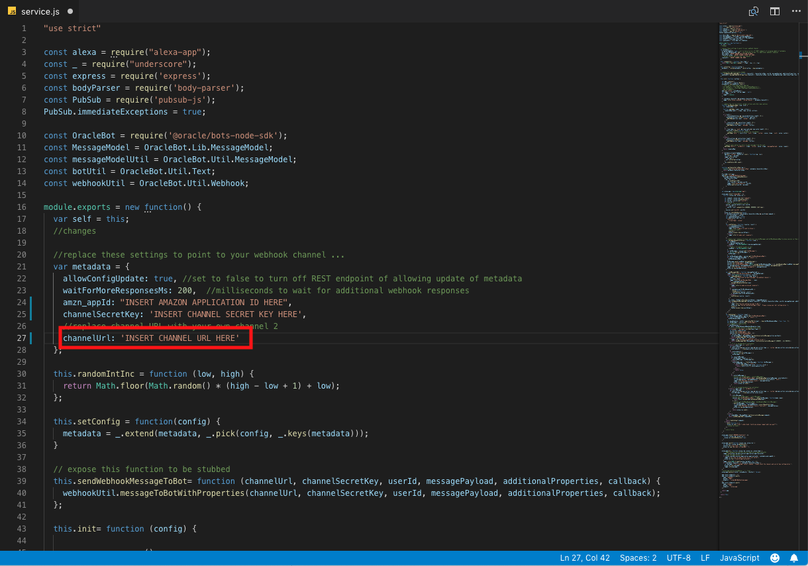

### **STEP 5**: Modify `package.json`

- Inside of the server you downloaded there is a file called `package.json`. Replace its contents with the code below. 

```
{
  "name": "oracle-bot-alexa",
  "version": "1.0.0",
  "description": "Alexa integration",
  "main": "service.js",
  "author": "",
  "license": "",
  "dependencies": {
    "@oracle/bots-node-sdk": "2.0.6",
    "alexa-app": "^4.2.0",
    "body-parser": "^1.15.2",
    "express": "^4.14.0",
    "pubsub-js": "^1.5.4",
    "underscore": "^1.8.3",
    "util": "^0.10.3"
  },
  "scripts": {
    "start": "node index.js"
  }
} 
```

### **STEP 5**: Deploy nodeJS application

- Open up terminal and navigate to your directory to where you Node JS server is located. Run these commands:

```
git add .
git commit -am "redeploying with correct variables"
git push heroku master
```

# Test the application

## We will test the application using the Alexa Developer Console.

### **STEP 1**: Test in Alexa Developer Console

- Navigate to your Alexa skill and select the **test** tab. Allow the page to use your microphone, and toggle **Off** to **Development**.

  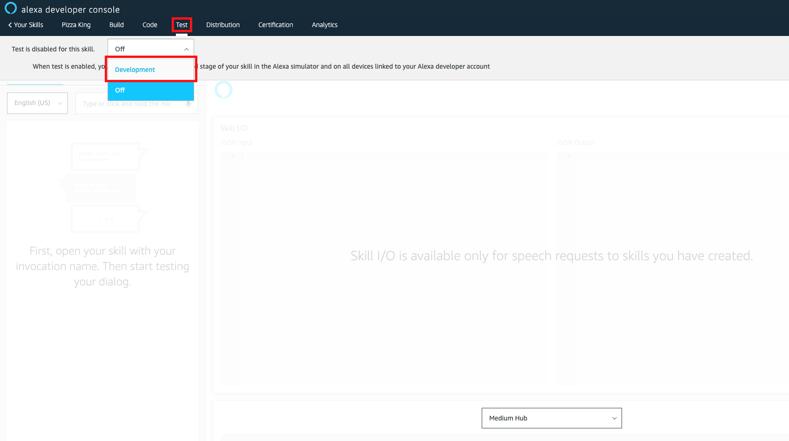

- You will be able to interact with you newly created skill by typing or using your microphone. The format to test is as follow:

```
Alexa, ask [invocation name] [utterance to send to digital assistant skill]
```

- For instance, if your invocation name was "Pizza King" and utterance was "what are my options", you would say:

```
alexa ask pizza king what are my options
```

(Note that punctuation is discarded when talking to the Alexa developer console. 

### **STEP 2**: Example test with the Pizza King bot

- If you hook up the [Pizza King skill](https://github.com/OracleMichael/ODA-Alexa-Workshop/raw/master/PizzaKing.zip) referenced in lab 050 step 4 to the digital assistant channel, you can test out this dialog by either typing in or talking to the Alexa developer console:

  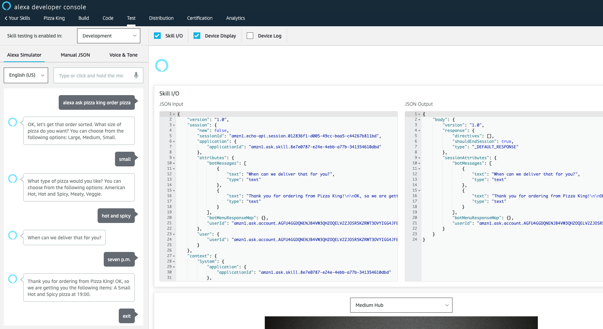

# Debugging

## This section details the most common errors on testing the integration and how to fix them.

The following list contains known fixes to known errors on testing the integration and is by no means an exhaustive list. These error messages are returned by Alexa in the developer console, Alexa mobile app, or Alexa device (for instance, the echo dot).

### Sorry, the application didn't know what to do with that intent

- The Alexa skill intent name should be the same as the name of the intent around line 129 of `service.js`. If, for instance, the name of the intent on the Alexa skill is **CustomIntent** then line 129 should be
  `alexa_app.intent("CustomIntent", {},`
  instead of
  `alexa_app.intent("CommandBot", {},`
- `AMAZON.FallbackIntent` is being matched; this requires changing alexa slot type values to the intents or utterances expected by digital assistant.
  - You can check if `AMAZON.FallbackIntent` is being matched by enabling **Skill I/O** (this should be checked already) on the Alexa test page and scrolling down "JSON Input" to the bottom. Check the "request" key and its associated value, then under request look for "intent" and under intent look for "name" (`request.intent.name`). It should be either `AMAZON.FallbackIntent` or "CommandBot" (or whatever your Alexa skill intent is named).
  - `AMAZON.FallbackIntent` is matched on Alexa's side only if the NLU interpreter on Alexa cannot categorize the intent for digital assistant as a valid intent on the Alexa skill (in this case, CommandBot), and this is due to that Alexa tries to parse the intent based on the given slot types. By changing the slot type values to the ones recognized by the digital assistant (for example, the names of the intents for the digital assistant skill used), Alexa will correctly link the intent to the CommandBot intent on Alexa.
- The utterance for CommandBot is not exactly `{command}`, for instance `command` or `order pizza {command}`. This will cause Alexa to parse the intent differently; for the second case, you would need to say "order pizza what are my options" to get "what are my options" passed to the digital assistant. If the utterance is incorrect, the JSON input should show that Alexa has matched the intent to `AMAZON.FallbackIntent` (see above).

### I am unable to reach the requested skill

- Alexa endpoint selection type is not correct. It **must** be the second one ("My development endpoint is a sub-domain...").

### There was a problem with the requested skill's response

- Alexa endpoint URL is not correct.
- Digital assistant channel is not enabled.
- Digital assistant channel **platform version** is "1.0 (Simple Model)" instead of "1.1 (Conversation Model)".
  - It might be the case where 1.0 (Simple Model) does not break the integration. Even so, this guide was built on the assumption that 1.1 (Conversation Model) was used. Some errors that are not addressed in this guide may be due to using the simple model.
- `service.js` has incorrect secret channel key and/or channel URL. Once you put the correct channel secret and/or channel URL into `service.js`, you will need to run the following commands:
```
git add .
git commit -am "Fixed Channel Secret and Channel URL"
git push heroku master
```
  - You can check the Skill I/O to differentiate this cause from the other aforementioned bugs. If `request.type` is a "SessionEndedRequest", then the channel key and/or channel URL might be incorrect.

### The requested skill did not provide a valid response

- Digital assistant channel `outgoing webhook URI` is incorrect.

### [no response]

- `service.js` has incorrect Alexa skill ID. Once you put the correct Alexa skill ID into `service.js`, you will need to run the following commands:
```
git add .
git commit -am "Fixed Alexa skill ID"
git push heroku master
```
  - You can check to see if the Heroku Node server has run into problems. On your Heroku application page click **More** and **View logs**. Give the logger about a minute to load properly, then try the utterance again. This time, the entire JSON input gets printed to the logger, along with any messages that the Node server generates. Refresh the page to clear most of the logs.
  - For this particular error, you should see an "Unhandled rejection Error: Invalid applicationId" somewhere in the logger.

### Your session has expired. Please start again.

- Digital assistant web channel session needs to be reset. You can do this by navigating to the digital assistant channel and clicking **Reset Sessions** on the right side.

### [any generic Alexa response]

Examples include "Hmmm... I don't understand" and "Sorry[...]" along with other prompts that are native to Alexa (e.g. when given "order pizza" Alexa will attempt to place an online order).
- The invocation name might be incorrect. For instance, you may have invoked "alexa ask pizza bot order pizza" when the invocation name is pizza king.

### [any specific response from Alexa]

Essentially, if there are ANY responses that Alexa doesn't seem to be capable of giving you on a normal basis (for instance, if Alexa starts to rattle off database entries), then...
- The wrong digital assistant skill may have been routed to the channel. This also assumes nothing else is wrong with the integration, as a valid response from a digital assistant skill was observed.

### Welcome to Singlebot.

This is not really an error. This occurs when the user does not provide an intent after the invocation, for instance simply saying "alexa ask pizza bot". The conversation context has not entered the digital assistant dialog flow yet, so you will need to properly invoke the digital assistant by following the proper syntax outlined in **STEP 1** of the **Test the application** section.


**This completes the ODA-Alexa Integration Workshop!**

